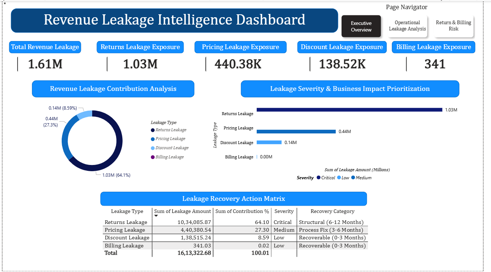
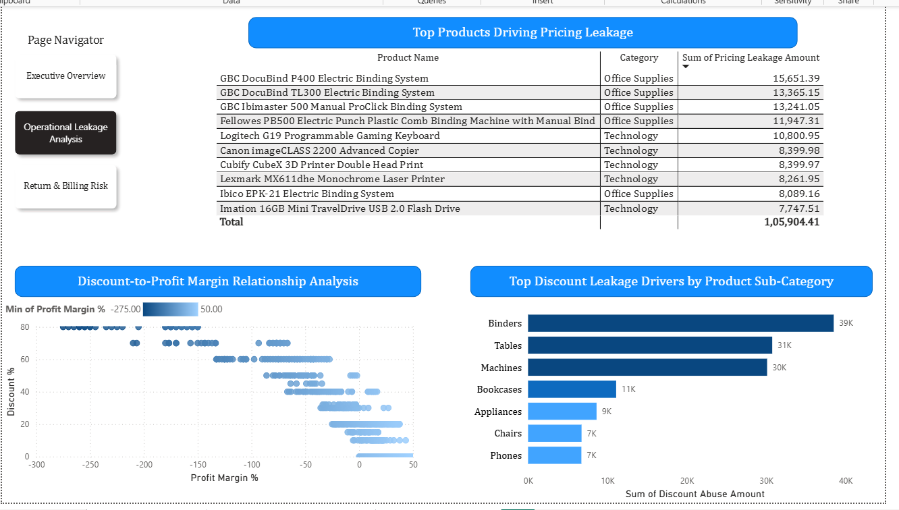
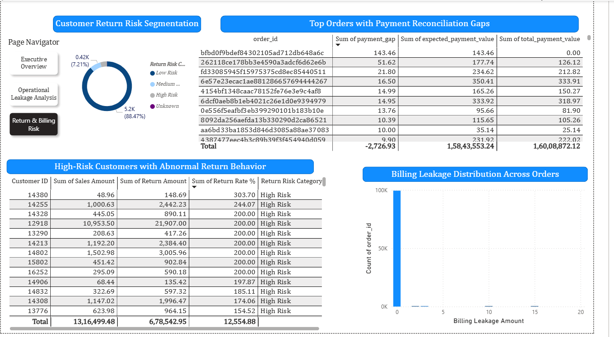

# Power BI Dashboard — Revenue Leakage Intelligence System

> The `.pbix` file is **not tracked in this repository.** Power BI Desktop files are compiled binaries — they do not render on GitHub, produce no meaningful diffs, and can exceed GitHub's 100 MB push limit. This README fully documents the dashboard so the work is transparent and reproducible without the file.

---

## Live Dashboard

**The published dashboard is publicly accessible here:**

🔗 **[View Live Dashboard](https://app.powerbi.com/view?r=eyJrIjoiOGM3YzE4NTktMjQ5Mi00ZjA4LTg5ODUtM2I2Nzg0MmI2Mjc5IiwidCI6ImM0NDIxZDFiLWZlMjctNDJmYS1hNDY3LTFmODFjMDJmN2MzZCJ9)**

No Power BI account is required to view it. Use the **Page Navigator** in the top-right corner to switch between the three report pages.

---

## Table of Contents

- [Dashboard Overview](#dashboard-overview)
- [Page 1 — Executive Overview](#page-1--executive-overview)
- [Page 2 — Operational Leakage Analysis](#page-2--operational-leakage-analysis)
- [Page 3 — Return & Billing Risk](#page-3--return--billing-risk)
- [Data Sources Connected](#data-sources-connected)
- [DAX Measures Used](#dax-measures-used)
- [Design Decisions](#design-decisions)
- [How to Rebuild Locally](#how-to-rebuild-locally)

---

## Dashboard Overview

| Property | Detail |
|---|---|
| Tool | Microsoft Power BI Desktop |
| Published via | Power BI Publish to Web (public embed) |
| Pages | 3 |
| Data source | Processed CSVs — `Data/Processed_Data/` |
| Navigation | Page Navigator panel (top-right, all pages) |
| Total leakage displayed | $1,613,322.68 |

**Screenshots** — available in `Images/` at project root:

| Page | File |
|---|---|
| Executive Overview | `Images/Executive_Overview.png` |
| Operational Leakage Analysis | `Images/Operational_Leakage_Analysis.png` |
| Return & Billing Risk | `Images/Return_&_Billing_Risk.png` |

---

## Page 1 — Executive Overview



**Purpose:** Top-level summary for leadership. All visuals on this page are driven by `master_kpi_summary.csv`.

---

### KPI Cards — top row (5 cards)

| Card Label | Value Displayed | Logic |
|---|---|---|
| Total Revenue Leakage | $1.61M | `SUM` of all leakage amounts |
| Returns Leakage Exposure | $1.03M | Filtered row — Leakage Type = Returns Leakage |
| Pricing Leakage Exposure | $440.38K | Filtered row — Leakage Type = Pricing Leakage |
| Discount Leakage Exposure | $138.52K | Filtered row — Leakage Type = Discount Leakage |
| Billing Leakage Exposure | $341 | Filtered row — Leakage Type = Billing Leakage |

---

### Revenue Leakage Contribution Analysis — Donut Chart

- **Values:** `Sum of Leakage Amount`
- **Legend:** `Leakage Type`
- **What it shows:** Returns dominates at 64.1% ($1.03M), followed by Pricing at 27.3% ($440K), Discount at 8.59% ($138K), and Billing at just 0.02% ($341)

---

### Leakage Severity & Business Impact Prioritisation — Horizontal Bar Chart

- **Y-axis:** `Leakage Type`
- **X-axis:** `Sum of Leakage Amount (Millions)`
- **Legend / colour:** `Severity` — Critical (dark navy), Medium (blue), Low (light blue)
- **What it shows:** Returns = Critical at 1.03M; Pricing = Medium at 0.44M; Discount = Low at 0.14M; Billing = Low at 0.00M

---

### Leakage Recovery Action Matrix — Table

| Column | Source Field |
|---|---|
| Leakage Type | `Leakage Type` |
| Sum of Leakage Amount | `Leakage Amount` |
| Sum of Contribution % | `Contribution %` |
| Severity | `Severity` |
| Recovery Category | `Recovery Category` |

**Recovery categories assigned in Python (Notebook 04) and passed through as-is:**

| Leakage Type | Severity | Recovery Category |
|---|---|---|
| Returns Leakage | Critical | Structural (6–12 Months) |
| Pricing Leakage | Medium | Process Fix (3–6 Months) |
| Discount Leakage | Low | Recoverable (0–3 Months) |
| Billing Leakage | Low | Recoverable (0–3 Months) |

---

## Page 2 — Operational Leakage Analysis



**Purpose:** Drill-down into *where* pricing and discount leakage is happening — which products and sub-categories are the biggest offenders. Driven by `superstore_analysis.csv`.

---

### Top Products Driving Pricing Leakage — Table

Sorted descending by `Sum of Pricing Leakage Amount`. Top 10 displayed:

| Product Name | Category | Pricing Leakage Amount |
|---|---|---|
| GBC DocuBind P400 Electric Binding System | Office Supplies | $15,651.39 |
| GBC DocuBind TL300 Electric Binding System | Office Supplies | $13,365.15 |
| GBC Ibimaster 500 Manual ProClick Binding System | Office Supplies | $13,241.05 |
| Fellowes PB500 Electric Punch Plastic Comb Binding Machine | Office Supplies | $11,947.31 |
| Logitech G19 Programmable Gaming Keyboard | Technology | $10,800.95 |
| Canon imageCLASS 2200 Advanced Copier | Technology | $8,399.98 |
| Cubify CubeX 3D Printer Double Head Print | Technology | $8,399.97 |
| Lexmark MX611dhe Monochrome Laser Printer | Technology | $8,261.95 |
| Ibico EPK-21 Electric Binding System | Office Supplies | $8,089.16 |
| Imation 16GB Mini TravelDrive USB 2.0 Flash Drive | Technology | $7,747.51 |

**Total across top 10: $1,05,904.41**

- **Columns:** `Product Name`, `Category`, `Sum of Pricing Leakage Amount`
- **Source fields:** `Product Name`, `Category`, `Pricing Leakage Amount` from `superstore_analysis`

---

### Discount-to-Profit Margin Relationship — Scatter Plot

- **X-axis:** `Profit Margin %` (range: −275 to +50)
- **Y-axis:** `Discount %` (range: 0 to 80)
- **Filter slider:** `Min of Profit Margin %` — interactive range −275 to +50
- **What it shows:** Clear negative correlation — as discount % increases beyond ~45%, profit margin collapses sharply and becomes deeply negative. The dense cluster of high-discount, deeply negative margin orders represents the discount abuse zone.

---

### Top Discount Leakage Drivers by Product Sub-Category — Horizontal Bar Chart

- **Y-axis:** `Sub-Category`
- **X-axis:** `Sum of Discount Abuse Amount`
- **Top sub-categories:**

| Sub-Category | Discount Abuse Amount |
|---|---|
| Binders | $39K |
| Tables | $31K |
| Machines | $30K |
| Bookcases | $11K |
| Appliances | $9K |
| Chairs | $7K |
| Phones | $7K |

---

## Page 3 — Return & Billing Risk



**Purpose:** Customer-level risk view — who is abusing returns, which orders have payment gaps, and how billing leakage is distributed. Driven by `uci_customer_return_analysis.csv` and `olist_billing_analysis.csv`.

---

### Customer Return Risk Segmentation — Donut Chart

- **Values:** `Count of Customer ID`
- **Legend:** `Return Risk Category`
- **Source:** `uci_customer_return_analysis`

| Risk Category | Customer Count | Share |
|---|---|---|
| Low Risk | 5.2K | 88.47% |
| Medium Risk | ~0.37K | ~6.3% |
| High Risk | ~0.42K | ~7.21% |
| Unknown | Negligible | — |

---

### High-Risk Customers with Abnormal Return Behaviour — Table

Sorted descending by `Sum of Return Rate %`. Filtered to `Return Risk Category = High Risk`.

- **Columns:** `Customer ID`, `Sum of Sales Amount`, `Sum of Return Amount`, `Sum of Return Rate %`, `Return Risk Category`
- **Source:** `uci_customer_return_analysis`

Notable cases from the top of the table:

| Customer ID | Sales Amount | Return Amount | Return Rate % |
|---|---|---|---|
| 14380 | $48.96 | $148.69 | 303.70% |
| 14255 | $1,000.63 | $2,442.23 | 244.07% |
| 12918 | $10,953.50 | $21,907.00 | 200.00% |
| 14802 | $1,502.98 | $3,005.96 | 200.00% |

> Customers with return rate > 100% (returned more value than they purchased) are potential fraud or data anomaly cases and warrant separate investigation.

---

### Top Orders with Payment Reconciliation Gaps — Table

Sorted descending by `Sum of payment_gap`. Filtered to orders where a billing leakage gap exists.

- **Columns:** `order_id`, `Sum of payment_gap`, `Sum of expected_payment_value`, `Sum of total_payment_value`
- **Source:** `olist_billing_analysis`

Top gap order: `bfbd0f9bdef84302105ad712db648a6c` — expected $143.46, received $0.00, gap = $143.46

---

### Billing Leakage Distribution Across Orders — Histogram

- **X-axis:** `Billing Leakage Amount` (range: 0 to 20)
- **Y-axis:** `Count of order_id`
- **What it shows:** Overwhelmingly right-skewed — the vast majority of orders have zero or near-zero billing leakage. A very small number of orders have leakage between $5–$20. Total billing leakage is only $341.03, confirming Olist's payment reconciliation is largely accurate.

---

## Data Sources Connected

| Table in Power BI | CSV File | Pages Used |
|---|---|---|
| `master_kpi_summary` | `master_kpi_summary.csv` | Page 1 |
| `superstore_analysis` | `superstore_analysis.csv` | Page 2 |
| `uci_customer_return_analysis` | `uci_customer_return_analysis.csv` | Page 3 |
| `olist_billing_analysis` | `olist_billing_analysis.csv` | Page 3 |

No cross-table relationships are defined in the Power BI data model. Each table feeds its designated page independently.

---

## DAX Measures Used

All aggregations on this dashboard use standard implicit measures (no custom DAX was required). The key computations are:

```
Total Leakage        = SUM(master_kpi_summary[Leakage Amount])
Contribution %       = SUM(master_kpi_summary[Contribution %])
Pricing Leakage      = SUM(superstore_analysis[Pricing Leakage Amount])
Discount Abuse       = SUM(superstore_analysis[Discount Abuse Amount])
Return Amount        = SUM(uci_customer_return_analysis[Return Amount])
Return Rate %        = SUM(uci_customer_return_analysis[Return Rate %])
Billing Leakage      = SUM(olist_billing_analysis[Billing Leakage Amount])
Payment Gap          = SUM(olist_billing_analysis[payment_gap])
```

Severity and Recovery Category fields are pre-computed in Python (Notebook 04) and loaded as plain text columns — no DAX classification logic needed in Power BI.

---

## Design Decisions

**Why three separate pages instead of one?**
Each page targets a different audience — Page 1 for executives (high-level KPIs), Page 2 for operations/sales managers (product and discount detail), Page 3 for finance/risk teams (customer and billing anomalies). Keeping them separate reduces cognitive load per audience.

**Why no cross-table relationships?**
The four datasets come from three different businesses in three different countries. Forcing a data model relationship between them would be semantically incorrect — there is no shared key (no common `customer_id`, `product_id`, or `order_id` across all tables).

**Why Page Navigator instead of tabs?**
Power BI's built-in Page Navigator button automatically stays in sync with report pages without maintaining any bookmark logic manually — cleaner and more maintainable.

---

## How to Rebuild Locally

1. Install [Power BI Desktop](https://powerbi.microsoft.com/desktop/) (free)
2. Run all four notebooks to generate the processed CSVs (see main `README.md`)
3. Open Power BI Desktop → `Home → Get Data → Text/CSV`
4. Connect all four CSVs from `Data/Processed_Data/`
5. In Power Query Editor — verify these column types:

   | Column | Expected Type |
   |---|---|
   | `Leakage Amount`, `Contribution %` | Decimal Number |
   | `Pricing Leakage Amount`, `Discount Abuse Amount` | Decimal Number |
   | `Return Amount`, `Return Rate %` | Decimal Number |
   | `Billing Leakage Amount`, `payment_gap` | Decimal Number |
   | `Severity`, `Recovery Category`, `Leakage Type` | Text |
   | `Customer ID`, `order_id` | Text |

6. Recreate visuals as documented above
7. Add Page Navigator: `Insert → Buttons → Navigator → Page Navigator`

---

*For questions about the data pipeline that feeds this dashboard, refer to the main project `README.md` and the notebooks in the `Notebooks/` folder.*